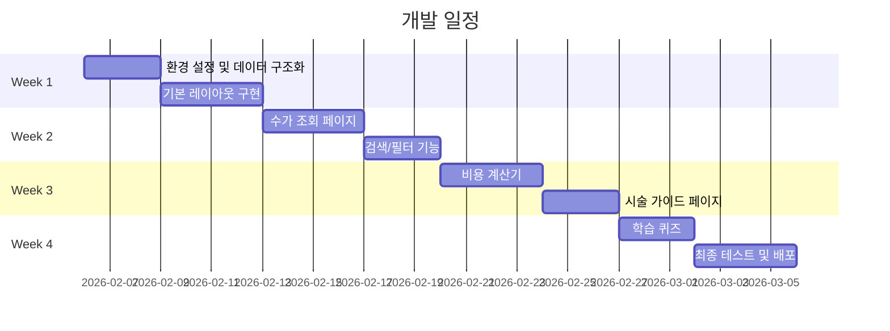

# 🏥 피부과 신입 직원 온보딩 플랫폼 PRD

> **Product Requirements Document**  
> 버전: 1.0.0  
> 최종 수정일: 2026-02-05  
> 작성자: Antigravity AI

---

## 📋 목차

1. [프로젝트 개요](#1-프로젝트-개요)
2. [배경 및 문제 정의](#2-배경-및-문제-정의)
3. [타겟 사용자](#3-타겟-사용자)
4. [핵심 기능 명세](#4-핵심-기능-명세)
5. [데이터 구조 설계](#5-데이터-구조-설계)
6. [화면별 상세 기획](#6-화면별-상세-기획)
7. [기술 스택](#7-기술-스택)
8. [프로젝트 구조](#8-프로젝트-구조)
9. [개발 마일스톤](#9-개발-마일스톤)
10. [성공 지표(KPI)](#10-성공-지표kpi)

---

## 1. 프로젝트 개요

### 1.1 프로젝트 이름
**Derm Assistant AI** (피부과 어시스턴트)

### 1.2 한 줄 요약
> 신입 피부과 직원이 복잡한 진료 수가를 쉽게 조회하고, 시술별 주의사항을 학습할 수 있는 **지능형 온보딩 웹 플랫폼**

### 1.3 핵심 목표
| 목표 | 설명 |
|------|------|
| 🎯 **지식의 표준화** | 모든 직원이 동일한 고품질 임상 데이터와 수가 정보를 학습 |
| ⚡ **운영의 효율화** | 신입 직원의 업무 숙달 시간 단축, 선임 직원의 교육 부담 감소 |
| 🔄 **지속 가능한 업데이트** | 수가 변경이나 새 장비 도입 시 쉽게 데이터 업데이트 가능 |

---

## 2. 배경 및 문제 정의

### 2.1 현재 상황
피부과 미용 시장이 급격히 성장하면서 시술 종류가 매우 다양해졌습니다:
- 보톡스, 필러, 스킨부스터, 리프팅 등 수십 가지 시술
- 국산/수입 제품에 따른 가격 차이
- 부위별, 용량별, 샷 수별 복잡한 수가 체계

### 2.2 문제점 (Pain Points)

```
❌ 신입 직원이 수십 가지 시술과 수가를 외우기 어려움
❌ 환자 상담 시 수가 조회에 시간 소요
❌ 시술별 주의사항을 제대로 안내하지 못해 고객 불만 발생
❌ 선임 직원의 반복적인 교육 부담
❌ 종이 자료나 엑셀 파일로 관리하여 업데이트가 어려움
```

### 2.3 해결 방안
웹 기반 온보딩 플랫폼을 통해:
- ✅ 검색 가능한 수가 데이터베이스 제공
- ✅ 직관적인 시술 비용 계산기 제공
- ✅ 시술별 상세 정보 및 주의사항 제공
- ✅ 퀴즈를 통한 학습 진행도 측정

---

## 3. 타겟 사용자

### 3.1 주 사용자 (Primary User)

| 구분 | 내용 |
|------|------|
| **직책** | 신입 상담 코디네이터, 피부 관리사, 간호조무사 |
| **경력** | 입사 0~6개월 |
| **니즈** | 빠르게 시술 정보와 수가를 파악하고 싶음 |
| **Pain Point** | 복잡한 수가 체계, 시술별 주의사항 암기 부담 |

### 3.2 보조 사용자 (Secondary User)

| 구분 | 내용 |
|------|------|
| **직책** | 원장, 교육담당자 |
| **니즈** | 신입 직원의 학습 진행 상황 파악, 수가 정보 업데이트 |

---

## 4. 핵심 기능 명세

### 4.1 기능 우선순위 (MoSCoW)

```
🟢 Must Have (필수)
🟡 Should Have (중요)
🔵 Could Have (있으면 좋음)
⚪ Won't Have (이번 버전 제외)
```

### 4.2 기능 목록

#### 🟢 Must Have (필수 기능)

| ID | 기능명 | 설명 |
|----|--------|------|
| F-001 | **수가 조회 대시보드** | 카테고리별(보톡스/필러/리프팅 등) 시술 수가를 테이블로 조회 |
| F-002 | **키워드 검색** | 시술명, 제품명으로 빠른 검색 가능 |
| F-003 | **시술 상세 정보** | 각 시술의 통증 정도, 마취 방법, 시술 시간, 회복 기간 표시 |
| F-004 | **사후 관리 가이드** | 시술별 주의사항 및 응급 상황 대응 매뉴얼 |
| F-005 | **모바일 반응형** | 태블릿, 모바일에서도 편리하게 사용 가능 |

#### 🟡 Should Have (중요 기능)

| ID | 기능명 | 설명 |
|----|--------|------|
| F-006 | **시술 비용 계산기** | 여러 시술을 선택하면 총 비용을 계산 (패키지 할인 자동 적용) |
| F-007 | **국산/수입 비교** | 같은 시술의 국산/수입 제품 가격 비교 |
| F-008 | **학습 퀴즈** | 시술 지식 테스트 퀴즈로 학습 효과 확인 |
| F-009 | **즐겨찾기** | 자주 조회하는 시술을 즐겨찾기에 저장 |

#### 🔵 Could Have (있으면 좋음)

| ID | 기능명 | 설명 |
|----|--------|------|
| F-010 | **AI 챗봇** | "울쎄라 샷당 가격이 얼마야?" 같은 자연어 질문 응답 |
| F-011 | **학습 진행도 대시보드** | 개인별 학습 현황 시각화 |
| F-012 | **원장용 관리 페이지** | 수가 정보 수정, 신규 시술 추가 |

---

## 5. 데이터 구조 설계

> 💡 **주니어 개발자 가이드**: 아래 JSON 구조를 `app/data/` 폴더에 저장합니다.

### 5.1 시술 수가 데이터 (fees.json)

```json
{
  "categories": [
    {
      "id": "botox",
      "name": "보톡스",
      "icon": "💉",
      "treatments": [
        {
          "id": "botox-forehead",
          "name": "이마 보톡스",
          "category": "주름 보톡스",
          "prices": {
            "domestic": {
              "price": 50000,
              "product": "메디톡신"
            },
            "imported": {
              "price": 100000,
              "product": "제오민"
            }
          },
          "unit": "1회",
          "description": "이마 주름 개선",
          "duration": "5-10분",
          "pain_level": 1,
          "downtime": "즉시 생활 가능",
          "anesthesia": "아이스 마취 또는 연고"
        }
      ]
    }
  ]
}
```

### 5.2 데이터 필드 설명

| 필드명 | 타입 | 설명 | 예시 |
|--------|------|------|------|
| `id` | string | 고유 식별자 | "botox-forehead" |
| `name` | string | 시술 이름 | "이마 보톡스" |
| `category` | string | 세부 카테고리 | "주름 보톡스" |
| `prices.domestic.price` | number | 국산 가격 (원) | 50000 |
| `prices.imported.price` | number | 수입 가격 (원) | 100000 |
| `unit` | string | 단위 | "1회", "1cc", "100샷" |
| `duration` | string | 시술 시간 | "5-10분" |
| `pain_level` | number | 통증 정도 (1-5) | 1 |
| `downtime` | string | 회복 기간 | "즉시 생활 가능" |
| `anesthesia` | string | 마취 방법 | "연고 마취" |

### 5.3 사후 관리 가이드 데이터 (aftercare.json)

```json
{
  "common_precautions": [
    "시술 후 1주일간 음주, 흡연 금지",
    "시술 후 1주일간 사우나, 찜질방 금지",
    "시술 후 1주일간 격한 운동 금지"
  ],
  "treatments": [
    {
      "id": "filler",
      "name": "필러",
      "precautions": [
        "시술 후 2주간 강한 압력 금지",
        "경락 마사지 2주간 금지"
      ]
    }
  ],
  "emergency_signs": [
    {
      "symptom": "시술 부위가 점점 검게 변함",
      "cause": "혈관 폐쇄 징후",
      "action": "즉시 원장에게 보고 및 환자 내원 조치"
    }
  ]
}
```

---

## 6. 화면별 상세 기획

### 6.1 전체 사이트맵

```
🏠 홈 (/)
├── 📊 수가 조회 (/fees)
│   ├── 보톡스 (/fees/botox)
│   ├── 필러 (/fees/filler)
│   ├── 스킨부스터 (/fees/skinbooster)
│   └── 리프팅 (/fees/lifting)
├── 🧮 비용 계산기 (/calculator)
├── 📚 시술 가이드 (/guide)
│   ├── 통증 및 마취 (/guide/pain)
│   └── 사후 관리 (/guide/aftercare)
├── 📝 학습 퀴즈 (/quiz)
└── ⭐ 즐겨찾기 (/favorites)
```

### 6.2 메인 페이지 (홈)

#### 6.2.1 레이아웃

```
┌─────────────────────────────────────────────────────────┐
│  [로고]  Derm Assistant AI          [검색바]    [메뉴]  │
├─────────────────────────────────────────────────────────┤
│                                                         │
│   🎯 오늘 배울 시술                                     │
│   ┌─────────┐ ┌─────────┐ ┌─────────┐                   │
│   │ 울쎄라  │ │ 리쥬란  │ │ 보톡스  │                   │
│   └─────────┘ └─────────┘ └─────────┘                   │
│                                                         │
│   📂 카테고리별 조회                                    │
│   ┌─────────┐ ┌─────────┐ ┌─────────┐ ┌─────────┐       │
│   │ 💉      │ │ 💧      │ │ ✨      │ │ 📈      │       │
│   │ 보톡스  │ │ 필러    │ │ 부스터  │ │ 리프팅  │       │
│   └─────────┘ └─────────┘ └─────────┘ └─────────┘       │
│                                                         │
│   🧮 빠른 비용 계산                                     │
│   [비용 계산기로 이동]                                  │
│                                                         │
└─────────────────────────────────────────────────────────┘
```

#### 6.2.2 컴포넌트 목록

| 컴포넌트명 | 파일 경로 | 설명 |
|------------|----------|------|
| `Header` | `components/Header.tsx` | 상단 네비게이션바 |
| `SearchBar` | `components/SearchBar.tsx` | 전역 검색창 |
| `CategoryCard` | `components/CategoryCard.tsx` | 카테고리 카드 |
| `QuickAccessButton` | `components/QuickAccessButton.tsx` | 빠른 접근 버튼 |

### 6.3 수가 조회 페이지

#### 6.3.1 레이아웃

```
┌─────────────────────────────────────────────────────────┐
│  [←] 보톡스 수가표                          [⭐즐겨찾기] │
├─────────────────────────────────────────────────────────┤
│                                                         │
│   [검색: 시술명 검색...]                                │
│                                                         │
│   필터: [전체▼] [국산/수입▼] [가격대▼]                 │
│                                                         │
│   ┌───────────────────────────────────────────────────┐ │
│   │ 시술명        │ 국산      │ 수입      │ 동작     │ │
│   ├───────────────────────────────────────────────────┤ │
│   │ 이마 보톡스   │ 5만원     │ 10만원    │ [상세]   │ │
│   │ 눈가 보톡스   │ 5만원     │ 10만원    │ [상세]   │ │
│   │ 미간 보톡스   │ 5만원     │ 10만원    │ [상세]   │ │
│   │ 사각턱 보톡스 │ 10만원    │ 15만원    │ [상세]   │ │
│   │ 승모근 보톡스 │ 15만원    │ 20만원    │ [상세]   │ │
│   └───────────────────────────────────────────────────┘ │
│                                                         │
└─────────────────────────────────────────────────────────┘
```

#### 6.3.2 기능 상세

| 기능 | 구현 방법 |
|------|----------|
| **정렬** | 시술명 가나다순, 가격순 정렬 가능 |
| **필터** | 국산만/수입만 필터링, 가격대 필터링 |
| **검색** | 시술명, 제품명으로 실시간 검색 |
| **상세보기** | 클릭 시 모달 또는 새 페이지로 상세 정보 표시 |

### 6.4 시술 상세 정보 모달

```
┌─────────────────────────────────────────────────────────┐
│  [X] 울쎄라 리프팅                              [⭐저장] │
├─────────────────────────────────────────────────────────┤
│                                                         │
│   💰 수가 정보                                          │
│   ┌─────────────────────────────────────────────────┐   │
│   │ 300샷: 120만원 (샷당 4,000원)                   │   │
│   │ 600샷: 200만원 (샷당 3,333원) ⭐추천             │   │
│   └─────────────────────────────────────────────────┘   │
│                                                         │
│   ℹ️ 시술 정보                                          │
│   • 통증: ⭐⭐⭐⭐ (중상 - 욱신거림)                    │
│   • 마취: 연고 마취 (30~40분)                          │
│   • 시술 시간: 40~60분                                 │
│   • 회복 기간: 즉시 생활 가능, 붓기 1~2주              │
│                                                         │
│   ⚠️ 시술 후 주의사항                                   │
│   • 1주일간 음주, 사우나 금지                          │
│   • 미온수 세안 권장                                    │
│                                                         │
│   [🧮 비용 계산기에 추가]                               │
│                                                         │
└─────────────────────────────────────────────────────────┘
```

### 6.5 비용 계산기 페이지

#### 6.5.1 레이아웃

```
┌─────────────────────────────────────────────────────────┐
│  [←] 시술 비용 계산기                                   │
├─────────────────────────────────────────────────────────┤
│                                                         │
│   🛒 선택한 시술                                        │
│   ┌─────────────────────────────────────────────────┐   │
│   │ 1. 울쎄라 300샷 (수입)        120만원    [−][+] │   │
│   │ 2. 리쥬란 힐러 2cc × 3회      110만원    [−][+] │   │
│   │    └ 📍 패키지 할인 적용됨 (-10만원)            │   │
│   │ 3. 이마 보톡스 (국산)           5만원    [−][+] │   │
│   └─────────────────────────────────────────────────┘   │
│                                                         │
│   ───────────────────────────────────────────────────   │
│   📊 합계                                               │
│   ┌─────────────────────────────────────────────────┐   │
│   │ 정가 합계:                           245만원    │   │
│   │ 패키지 할인:                         -10만원    │   │
│   │ ─────────────────────────────────────────────   │   │
│   │ 최종 금액:                           235만원    │   │
│   └─────────────────────────────────────────────────┘   │
│                                                         │
│   [+ 시술 추가하기]     [🗑️ 전체 삭제]    [📋 복사]     │
│                                                         │
└─────────────────────────────────────────────────────────┘
```

#### 6.5.2 패키지 할인 로직

```javascript
// 패키지 할인 예시 (리쥬란 3회 패키지)
const packageDiscounts = {
  "rejuran-3pack": {
    items: [{ id: "rejuran-2cc", quantity: 3 }],
    originalPrice: 1200000,  // 40만원 × 3회 = 120만원
    discountedPrice: 1100000, // 패키지가 110만원
    discountRate: 8.3  // 약 8.3% 할인
  }
};
```

---

## 7. 기술 스택

### 7.1 개발 환경

| 구분 | 기술 | 버전 | 선택 이유 |
|------|------|------|----------|
| **Framework** | Next.js | 15.x | App Router, RSC 지원 |
| **Language** | TypeScript | 5.x | 타입 안정성, 자동완성 |
| **Styling** | Tailwind CSS | 3.x | 빠른 UI 개발 |
| **State** | React Context / Zustand | - | 간단한 상태 관리 |
| **Data** | JSON 파일 | - | 초기에는 정적 데이터 사용 |

### 7.2 향후 확장 시 기술

| 구분 | 기술 | 용도 |
|------|------|------|
| **Database** | Supabase / Firebase | 실시간 데이터, 인증 |
| **AI** | OpenAI API | 챗봇 기능 |
| **Analytics** | Vercel Analytics | 사용자 행동 분석 |

---

## 8. 프로젝트 구조

> 💡 **주니어 개발자 가이드**: 아래 폴더 구조대로 파일을 생성하세요.

```
derm-assistant-ai/
├── app/                          # Next.js App Router
│   ├── layout.tsx               # 전역 레이아웃
│   ├── page.tsx                 # 홈페이지
│   ├── fees/                    # 수가 조회
│   │   ├── page.tsx            # 전체 수가 목록
│   │   └── [category]/         # 카테고리별 수가
│   │       └── page.tsx
│   ├── calculator/              # 비용 계산기
│   │   └── page.tsx
│   ├── guide/                   # 시술 가이드
│   │   ├── page.tsx
│   │   ├── pain/               # 통증/마취 정보
│   │   │   └── page.tsx
│   │   └── aftercare/          # 사후 관리
│   │       └── page.tsx
│   ├── quiz/                    # 학습 퀴즈
│   │   └── page.tsx
│   └── favorites/               # 즐겨찾기
│       └── page.tsx
│
├── components/                   # 재사용 컴포넌트
│   ├── ui/                      # 기본 UI 요소
│   │   ├── Button.tsx
│   │   ├── Card.tsx
│   │   ├── Modal.tsx
│   │   └── Table.tsx
│   ├── layout/                  # 레이아웃 컴포넌트
│   │   ├── Header.tsx
│   │   ├── Footer.tsx
│   │   └── Sidebar.tsx
│   ├── fees/                    # 수가 관련 컴포넌트
│   │   ├── FeeTable.tsx
│   │   ├── FeeCard.tsx
│   │   └── FeeFilter.tsx
│   ├── calculator/              # 계산기 컴포넌트
│   │   ├── Calculator.tsx
│   │   └── CartItem.tsx
│   └── search/                  # 검색 컴포넌트
│       └── SearchBar.tsx
│
├── data/                        # 정적 데이터
│   ├── fees.json               # 수가 데이터
│   ├── aftercare.json          # 사후 관리 데이터
│   └── quiz.json               # 퀴즈 데이터
│
├── lib/                         # 유틸리티
│   ├── utils.ts                # 공통 함수
│   └── constants.ts            # 상수 정의
│
├── hooks/                       # 커스텀 훅
│   ├── useFees.ts              # 수가 데이터 훅
│   ├── useCalculator.ts        # 계산기 로직 훅
│   └── useFavorites.ts         # 즐겨찾기 훅
│
├── types/                       # TypeScript 타입
│   └── index.ts                # 타입 정의
│
├── styles/                      # 스타일
│   └── globals.css             # 전역 스타일
│
└── public/                      # 정적 파일
    └── icons/                  # 아이콘 이미지
```

---

## 9. 개발 마일스톤

### 9.1 전체 일정 (총 4주)



### 9.2 주차별 상세 태스크

#### Week 1: 기초 작업 (2/6 ~ 2/12)

| 태스크 | 담당 파일 | 완료 조건 |
|--------|----------|----------|
| 프로젝트 세팅 | `package.json`, `tsconfig.json` | TailwindCSS 설정 완료 |
| 데이터 구조화 | `data/fees.json` | PDF 내 모든 수가 데이터 입력 |
| 타입 정의 | `types/index.ts` | 모든 데이터 타입 정의 |
| 기본 레이아웃 | `app/layout.tsx`, `components/layout/*` | 헤더, 네비게이션 완성 |

#### Week 2: 수가 조회 (2/13 ~ 2/19)

| 태스크 | 담당 파일 | 완료 조건 |
|--------|----------|----------|
| 수가 목록 페이지 | `app/fees/page.tsx` | 카테고리별 테이블 표시 |
| 테이블 컴포넌트 | `components/fees/FeeTable.tsx` | 정렬, 페이지네이션 동작 |
| 검색 기능 | `components/search/SearchBar.tsx` | 실시간 검색 동작 |
| 필터 기능 | `components/fees/FeeFilter.tsx` | 국산/수입 필터 동작 |
| 상세 모달 | `components/ui/Modal.tsx` | 시술 상세 정보 표시 |

#### Week 3: 계산기 & 가이드 (2/20 ~ 2/26)

| 태스크 | 담당 파일 | 완료 조건 |
|--------|----------|----------|
| 비용 계산기 | `app/calculator/page.tsx` | 시술 추가/삭제, 합계 계산 |
| 패키지 할인 | `hooks/useCalculator.ts` | 패키지 할인 자동 적용 |
| 통증/마취 가이드 | `app/guide/pain/page.tsx` | 통증 레벨 시각화 |
| 사후 관리 가이드 | `app/guide/aftercare/page.tsx` | 주의사항 체크리스트 |

#### Week 4: 퀴즈 & 배포 (2/27 ~ 3/5)

| 태스크 | 담당 파일 | 완료 조건 |
|--------|----------|----------|
| 학습 퀴즈 | `app/quiz/page.tsx` | 퀴즈 문제 출제, 채점 |
| 즐겨찾기 | `app/favorites/page.tsx` | LocalStorage 저장 |
| 반응형 테스트 | 전체 | 모바일/태블릿 대응 완료 |
| Vercel 배포 | - | 프로덕션 URL 발급 |

---

## 10. 성공 지표 (KPI)

### 10.1 정량적 지표

| 지표 | 목표 | 측정 방법 |
|------|------|----------|
| **수가 조회 시간** | 10초 이내 | 사용자 테스트 |
| **신입 교육 시간** | 기존 대비 50% 단축 | 교육 담당자 피드백 |
| **일일 활성 사용자** | 전 직원 80% 이상 | 페이지 방문 로그 |
| **퀴즈 평균 점수** | 80점 이상 | 퀴즈 결과 데이터 |

### 10.2 정성적 지표

| 지표 | 목표 | 측정 방법 |
|------|------|----------|
| **사용 편의성** | "찾기 쉽다" 응답 90% | 사용자 설문 |
| **정보 정확성** | 오류 신고 0건 | 직원 피드백 |
| **디자인 만족도** | 4.5점 이상 (5점 만점) | 사용자 설문 |

---

## 📌 부록

### A. 진료 수가 데이터 요약

> 아래는 `피부과_진료_수가.pdf`에서 추출해야 할 핵심 데이터입니다.

#### 보톡스

| 시술 | 국산(메디톡신) | 수입(제오민) |
|------|---------------|-------------|
| 이마/미간/눈가 | 5만원 | 10만원 |
| 사각턱 | 10만원 | 15만원 |
| 승모근/종아리 | 15만원 | 20만원 |
| 특수부위(침샘/다한증) | 30만원 | 40만원 |
| 스킨보톡스 | 10~15만원 | 15~20만원 |

#### 필러 & 스킨부스터

| 시술 | 수가 |
|------|------|
| 국산 필러 (이니티움) 1cc | 20만원 |
| 수입 필러 (벨로테로) 1cc | 50만원 |
| 엘란쎄 1년/2년 | 45만원/50만원 |
| 리쥬란 힐러 2cc | 40만원 |
| 리쥬란 3회 패키지 | 110만원 |
| 쥬베룩 | 70만원 |
| 엑소좀 | 70만원 |
| 울트라콜 | 70만원 |

#### 리프팅

| 장비 | 규격 | 수가 | 샷당 단가 |
|------|------|------|----------|
| 울쎄라 | 300샷 | 120만원 | 4,000원 |
| 울쎄라 | 600샷 | 200만원 | 3,333원 |
| 써마지 | 300샷 | 150만원 | 5,000원 |
| 써마지 | 600샷 | 250만원 | 4,166원 |
| 슈링크 | 300샷 | 27만원 | 900원 |
| 슈링크 | 400샷 | 36만원 | 900원 |

---

### B. 용어 정리 (신입 직원용)

| 용어 | 설명 |
|------|------|
| **PDRN** | 조직 재생 촉진 성분, 연어 DNA 유래 |
| **PN** | 리쥬란의 주성분, 피부 장벽 강화 효과 |
| **PLLA** | 스컬트라 성분, 콜라겐 생성 유도 |
| **PDLLA** | 쥬베룩 성분, PLLA보다 부작용 적음 |
| **HA** | 히알루론산, 필러의 주성분 |
| **EBD** | Energy-Based Device, 레이저/고주파 장비 |
| **Downtime** | 시술 후 일상 복귀까지 걸리는 시간 |

---

> 📝 **문서 변경 이력**
> 
> | 버전 | 날짜 | 변경 내용 | 작성자 |
> |------|------|----------|--------|
> | 1.0.0 | 2026-02-05 | 최초 작성 | Antigravity AI |
